# Flutter Device Features Mini Project

Flutter app that opens device features from a side drawer: device info, fingerprint auth, camera and gallery, a Google Map with GPS, and a sound recorder and player. The home app bar asks for a fingerprint before opening the profile page.

---

## Requirements

- [Flutter SDK](https://docs.flutter.dev/get-started/install) (Dart `^3.12.2`)
- Git
- A device or emulator for `flutter run` (camera, fingerprint, GPS, and the microphone need a device that supports them)

Check your setup:

```bash
flutter doctor
```


---

## Clone the project

```bash
git clone https://github.com/AhmedSobhyHamed/FlutterDeviceFeatures_MiniProject.git
cd FlutterDeviceFeatures_MiniProject
```

```bash
flutter create . --project-name flutterdevicefeatures_miniproject --platforms=web,android,linux
```
or
```bash
podman exec -it flutter_dev sh -c "cd apps/FlutterDeviceFeatures_MiniProject; flutter create . --project-name flutterdevicefeatures_miniproject --platforms=web,android,linux"
```

---

## Install packages

From the project root:

```bash
flutter pub get
```

```bash
flutter pub add device_info_plus:^13.2.0
flutter pub add local_auth:^3.0.2
flutter pub add geolocator:^14.1.1
flutter pub add google_maps_flutter:^2.18.1
flutter pub add image_picker:^1.2.3
flutter pub add flutter_blue_plus:^2.3.13
flutter pub add audioplayers:^6.8.1
flutter pub add flutter_sound:^9.30.0
flutter pub add shared_preferences:^2.5.5
flutter pub add flutter_localization:^0.4.1
flutter pub add path_provider:^2.1.6
flutter pub add permission_handler:^13.0.2
```
or
```bash
podman exec -it flutter_dev sh -c "cd apps/FlutterDeviceFeatures_MiniProject; flutter pub add device_info_plus:^13.2.0"
podman exec -it flutter_dev sh -c "cd apps/FlutterDeviceFeatures_MiniProject; flutter pub add local_auth:^3.0.2"
podman exec -it flutter_dev sh -c "cd apps/FlutterDeviceFeatures_MiniProject; flutter pub add geolocator:^14.1.1"
podman exec -it flutter_dev sh -c "cd apps/FlutterDeviceFeatures_MiniProject; flutter pub add google_maps_flutter:^2.18.1"
podman exec -it flutter_dev sh -c "cd apps/FlutterDeviceFeatures_MiniProject; flutter pub add image_picker:^1.2.3"
podman exec -it flutter_dev sh -c "cd apps/FlutterDeviceFeatures_MiniProject; flutter pub add flutter_blue_plus:^2.3.13"
podman exec -it flutter_dev sh -c "cd apps/FlutterDeviceFeatures_MiniProject; flutter pub add audioplayers:^6.8.1"
podman exec -it flutter_dev sh -c "cd apps/FlutterDeviceFeatures_MiniProject; flutter pub add flutter_sound:^9.30.0"
podman exec -it flutter_dev sh -c "cd apps/FlutterDeviceFeatures_MiniProject; flutter pub add shared_preferences:^2.5.5"
podman exec -it flutter_dev sh -c "cd apps/FlutterDeviceFeatures_MiniProject; flutter pub add flutter_localization:^0.4.1"
podman exec -it flutter_dev sh -c "cd apps/FlutterDeviceFeatures_MiniProject; flutter pub add path_provider:^2.1.6"
podman exec -it flutter_dev sh -c "cd apps/FlutterDeviceFeatures_MiniProject; flutter pub add permission_handler:^13.0.2"
```

This installs:

| Package | Role |
|---|---|
| `device_info_plus` | Device name, manufacturer, and OS on Android, Linux, and web |
| `local_auth` | Fingerprint prompt for Add Auth and the profile gate |
| `geolocator` | Current GPS position for the map |
| `google_maps_flutter` | Map, camera, and markers |
| `image_picker` | Camera and gallery photos and videos |
| `audioplayers` | Play, pause, stop, seek, volume, and speed |
| `flutter_sound` | Microphone recording into the app documents folder |
| `path_provider` | Documents directory for saved recordings |
| `permission_handler` | Microphone permission before recording |
| `shared_preferences` | Local key-value storage through `LocalData` |
| `flutter_blue_plus` | Bluetooth |
| `flutter_localization` | Localization |
| `cupertino_icons` | Icons |

Android location, background location, microphone, and storage are declared in `android/app/src/main/AndroidManifest.xml`. The Maps key is the `com.google.android.geo.API_KEY` meta-data in that same file.

---

## Run the project

```bash
flutter devices
flutter run
```

Pick a device if more than one is connected:

```bash
flutter run -d emulator-5554
flutter run -d linux
flutter run -d chrome
```

About works on Android, Linux, and Chrome. Camera files, fingerprint, GPS, and recording are meant for a phone or emulator.

---

## Tech stack

| Layer | Technology |
|---|---|
| UI | Flutter, Material 3 |
| Language | Dart 3.12+ |
| Navigation | Drawer — About, Add Auth, Camera, Map, Sound Player |
| Device info | `device_info_plus` — Android, Linux, and web readers |
| Auth | `local_auth` — fingerprint before Profile |
| Camera | `image_picker` — photo, multi-photo, and video |
| Map | `google_maps_flutter` + `geolocator` |
| Audio | `flutter_sound` record, `audioplayers` playback |
| Storage | `shared_preferences` (`LocalData`); recordings under app documents |
| Permissions | `permission_handler` plus the Android manifest |

---

## Project structure

```
lib/
├── main.dart                                      # App entry: MaterialApp → HomePage
├── core/
│   └── services/
│       └── data/
│           ├── data_interface.dart                # save / get / delete
│           └── local_data.dart                    # SharedPreferences implementation
└── futures/
    ├── home/
    │   └── presentation/
    │       ├── pages/
    │       │   └── home_page.dart                 # App bar, drawer, profile gate
    │       └── widgets/
    │           ├── menu_buttom.dart               # Opens the drawer
    │           └── side_menu.dart                 # Feature list
    ├── about/
    │   ├── data/
    │   │   ├── android_info.dart
    │   │   ├── linux_info.dart
    │   │   └── web_info.dart
    │   ├── domain/
    │   │   ├── device_info.dart                   # Picks a reader by platform
    │   │   └── device_info_interface.dart
    │   └── presentation/
    │       ├── pages/
    │       │   └── about_page.dart
    │       └── widgets/
    │           └── about_col.dart                 # Name, manufacturer, OS
    ├── auth/
    │   ├── domain/
    │   │   └── auth_finger.dart                   # canAuthenticate / addFingerprint
    │   └── presentation/
    │       └── pages/
    │           ├── add_auth.dart                  # Scan, then add another
    │           └── profile_page.dart
    ├── camera/
    │   ├── domain/
    │   │   └── camera.dart                        # Camera and gallery picks
    │   └── presentation/
    │       ├── pages/
    │       │   └── camera_page.dart
    │       └── widgets/
    │           ├── camera_view.dart               # Image list
    │           └── control_bar.dart               # Photo, gallery, video actions
    ├── map/
    │   ├── domain/
    │   │   └── current_position.dart              # Geolocator → LatLng
    │   └── presentation/
    │       └── pages/
    │           └── map_page.dart                  # Markers and camera moves
    └── audio/
        └── presentation/
            └── pages/
                └── sound_player.dart              # Record, list, and play
```

### How the layers fit

- **Home** — one `Scaffold` with a drawer. Each item pushes its own page. The person icon runs `AuthFinger` and opens `ProfilePage` only after a successful fingerprint.
- **About** — `DeviceInfo` loads Android, Linux, or web data. `AboutColumn` shows name, manufacturer, OS, and OS version.
- **Add Auth** — `local_auth` scan. A second step confirms the fingerprint and can start another scan.
- **Camera** — `Camera` wraps `image_picker`. The control bar takes a photo, picks one or many gallery images, records a video, or picks a gallery video. `CameraView` lists the images.
- **Map** — starts with a marker on Cairo. The buttons read the current GPS fix, move the camera there, drop a marker at the map center, or clear markers.
- **Sound Player** — `flutter_sound` writes `.aac` files under the app documents `audios` folder. `audioplayers` plays a selected file with pause, stop, seek, volume, and speed (`0.5` to `3`).
- **Core** — `LocalData` stores strings with `shared_preferences` behind `DataInterface`.

---

## Useful commands

```bash
flutter pub get          # install dependencies
flutter run              # run on a connected device
flutter test             # run tests
flutter analyze          # static analysis
```

---

## Screenshots

### Home

Device control screen, and the drawer with About, Add Auth, Camera, Map, and Sound Player.

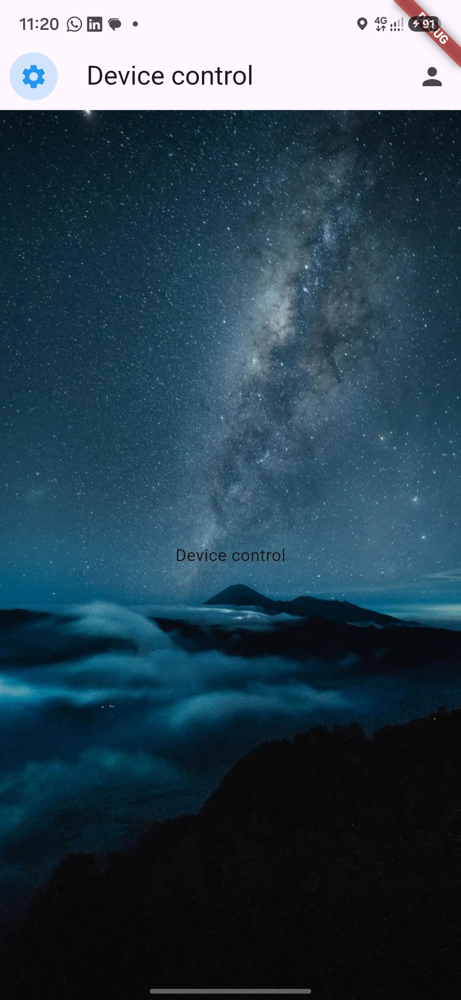
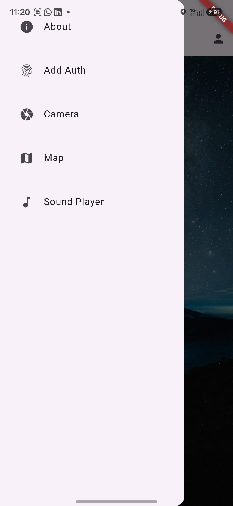

### About

Device name, manufacturer, operating system, and version.

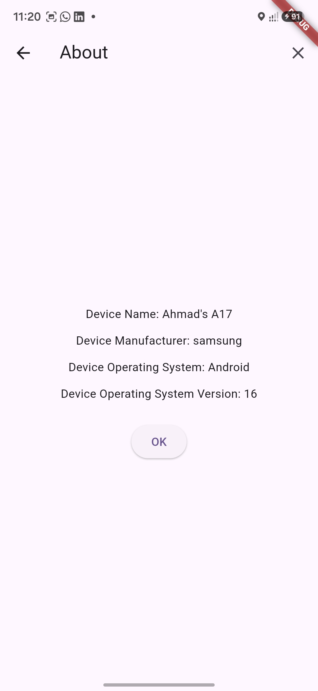

### Add Auth

Scan page, the system fingerprint prompt, and a failed scan.

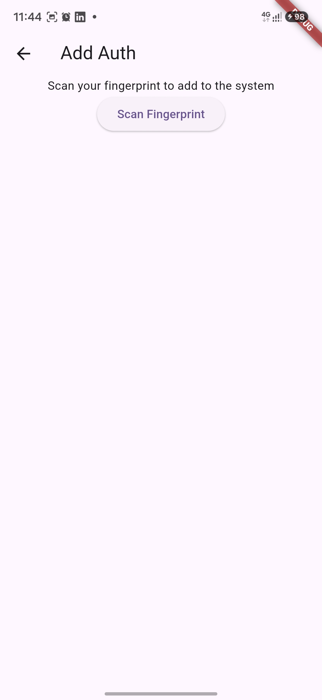
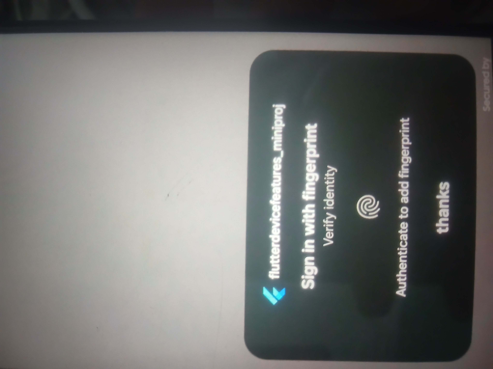
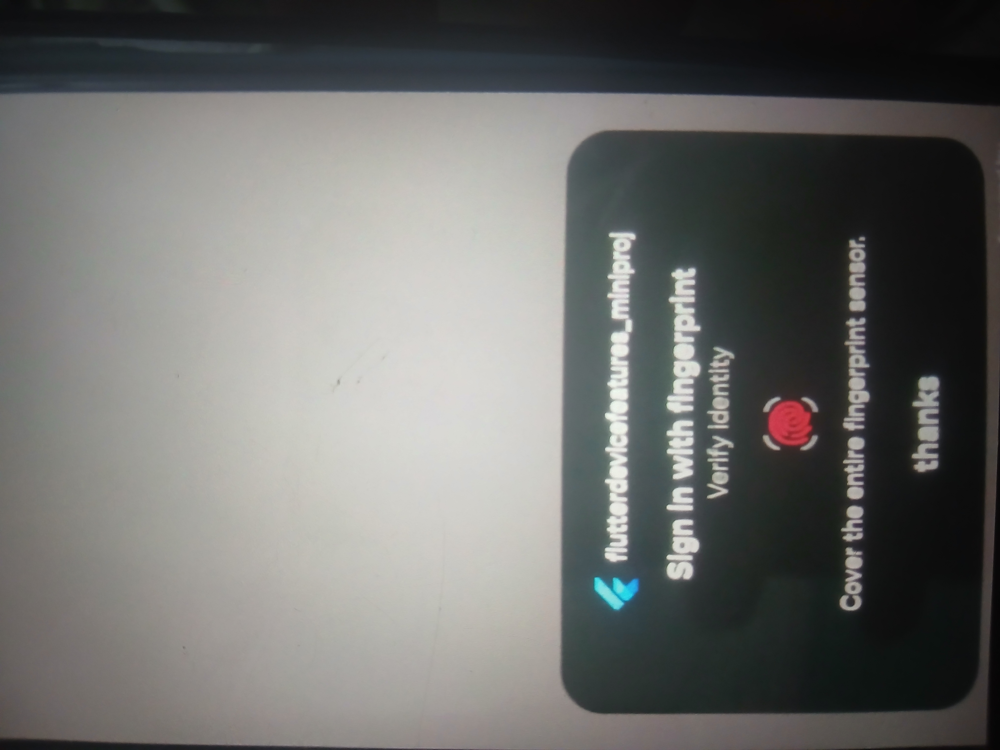

### Profile

Opened from the app bar after a successful fingerprint.

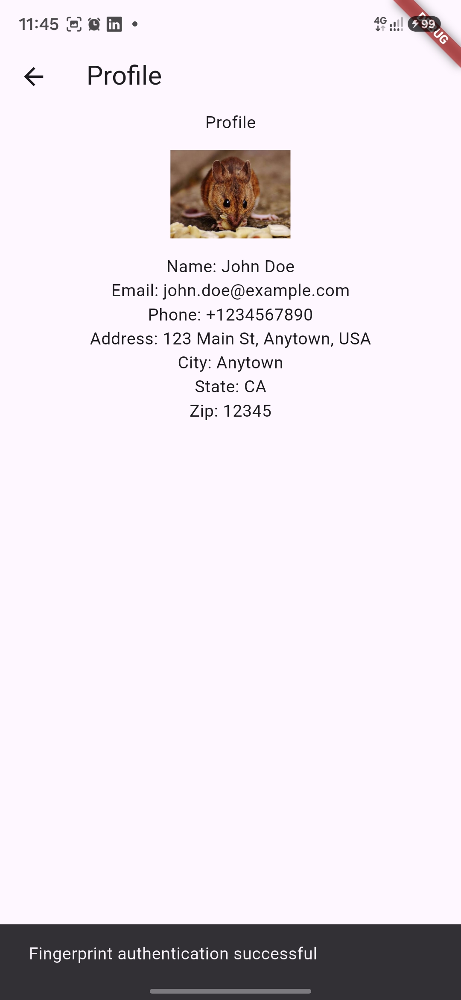

### Camera

Control bar, the camera, and a multi-photo pick from the gallery.


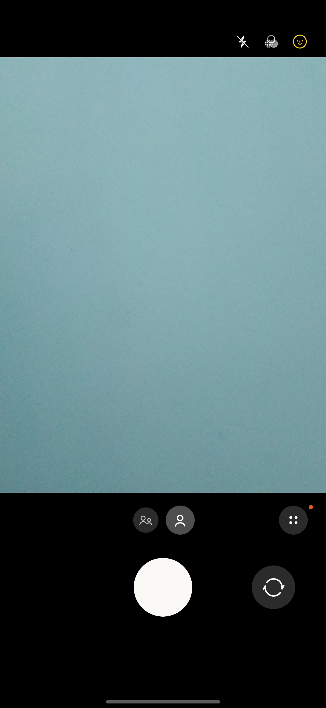
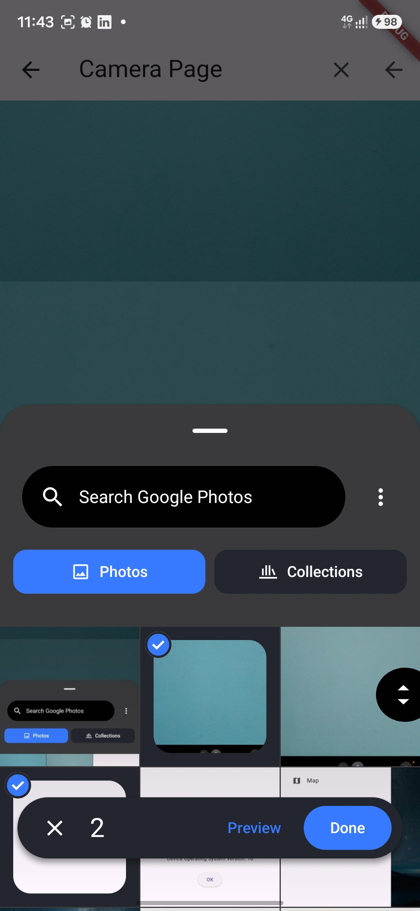

### Map

Marker on Cairo, with buttons for the current location, moving the camera, clearing markers, and adding a marker.

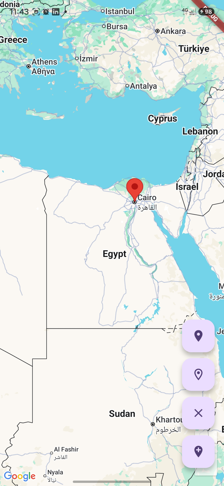

### Sound Player

Record button, playback controls (seek, play, stop, volume, and speed), and the list of saved `.aac` files. Recording asks for microphone permission first.

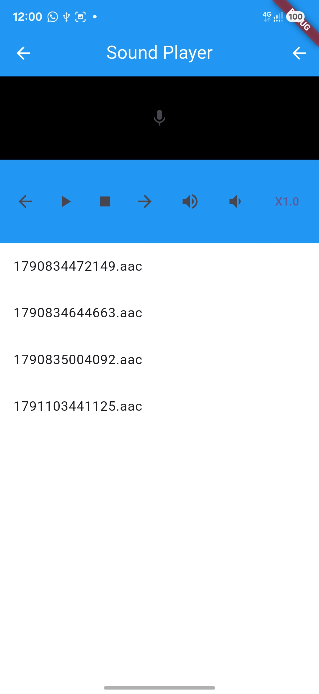
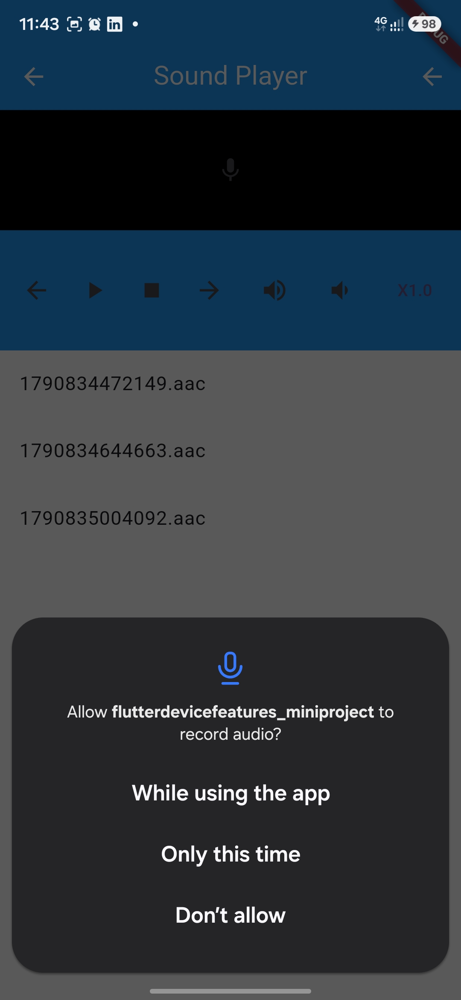
